# Solid Shadow

Personal Fedora GNOME dotfiles focused on desktop customization, shell configuration, development tools, themes, and GNOME extension settings.
## Theme


| | |
|---|---|
| 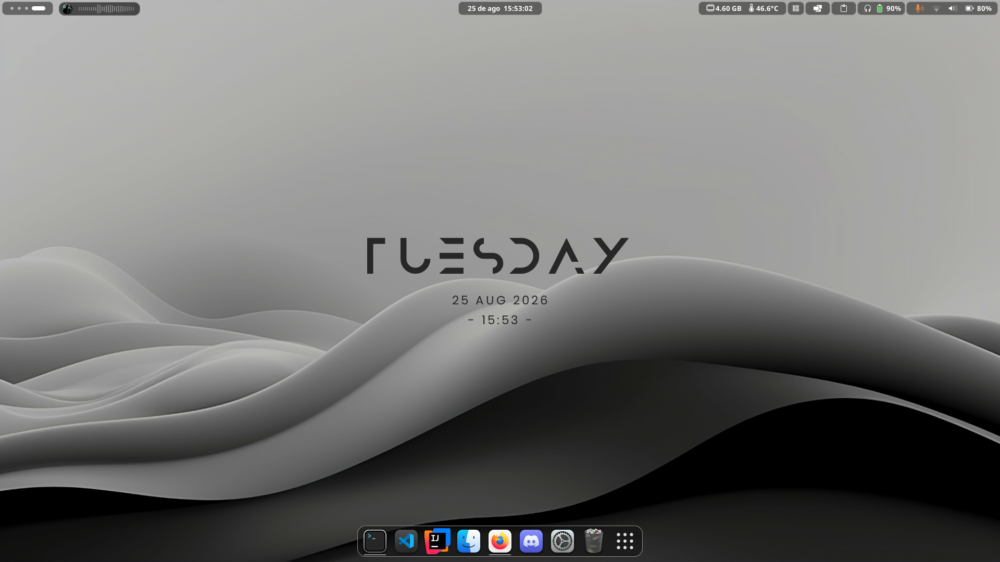 | 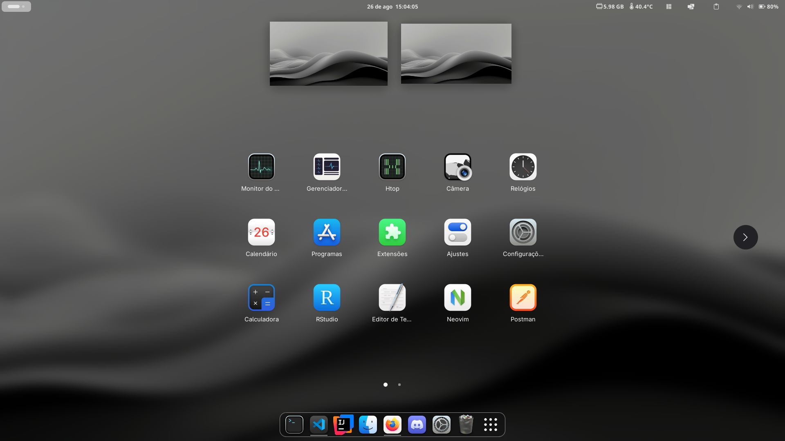 |
| 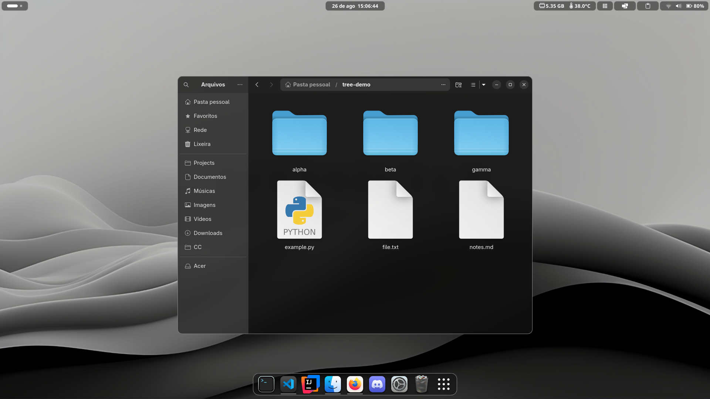 | 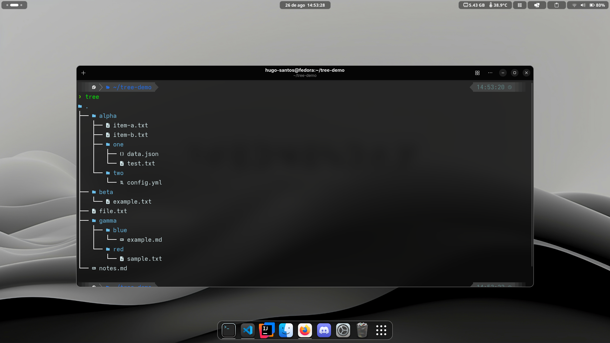 |
| 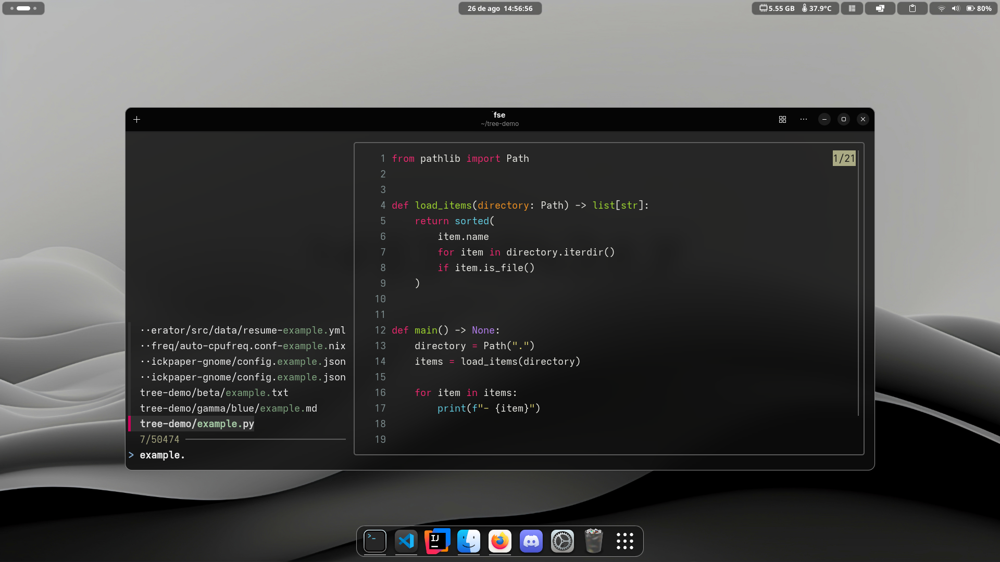 | 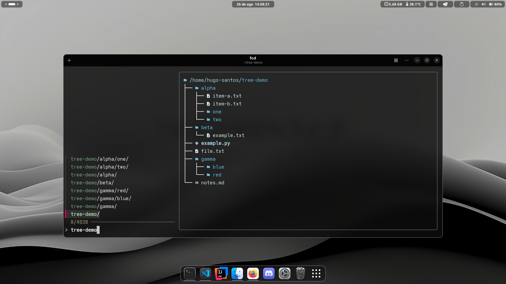 |

### Applications

| | |
|---|---|
| 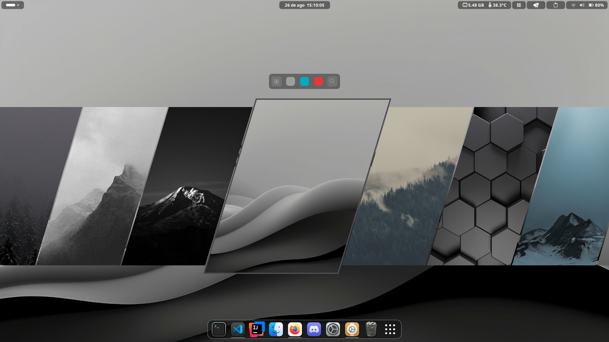 | 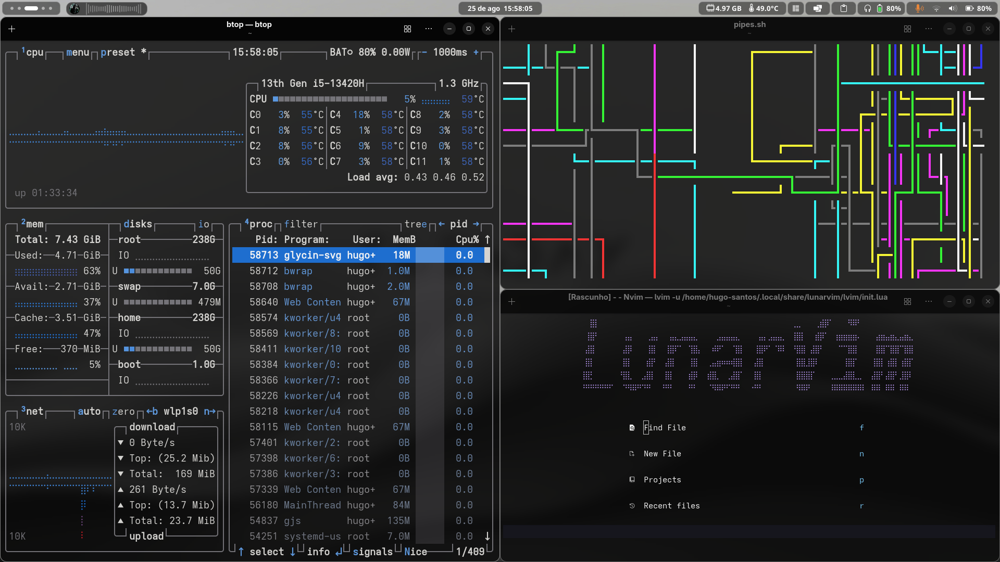 |
| 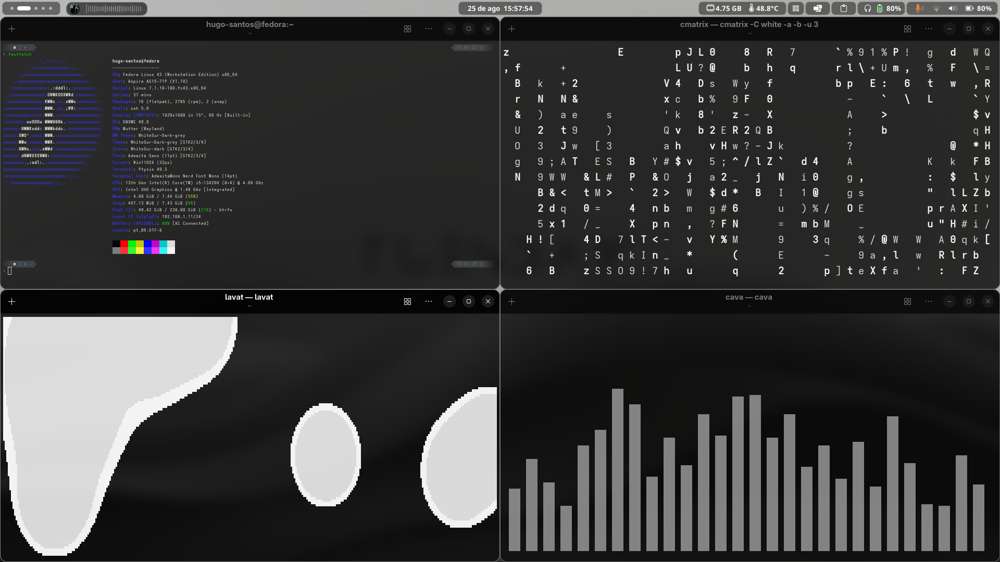 | 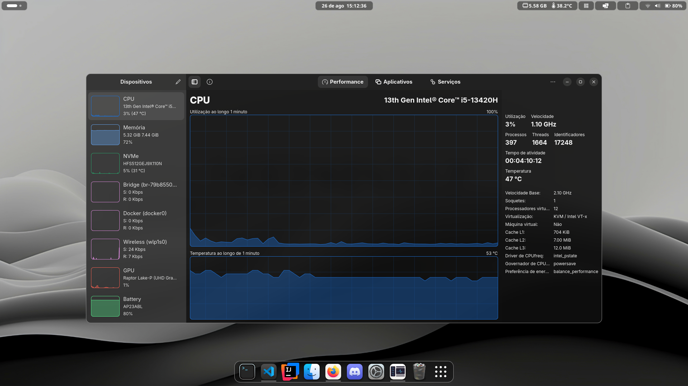 |

### Extensions

| | |
|---|---|
| 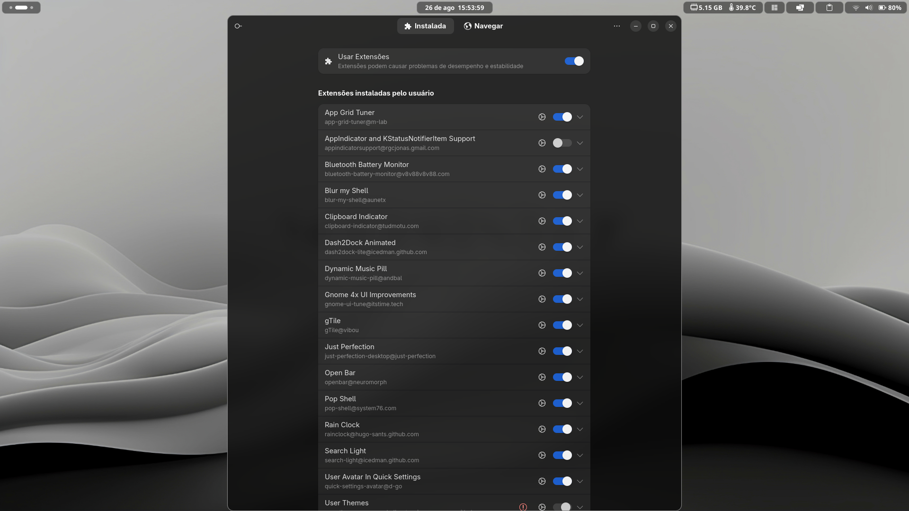 | 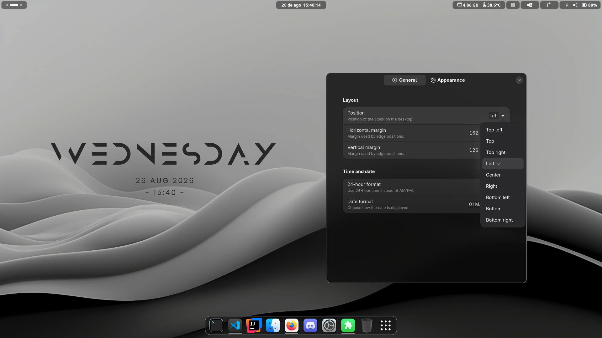 |
| 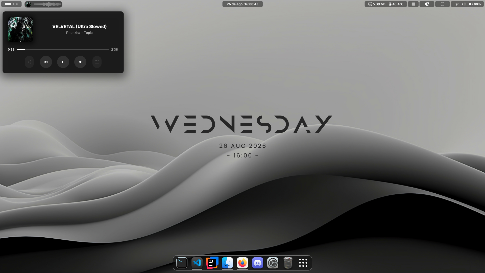 | 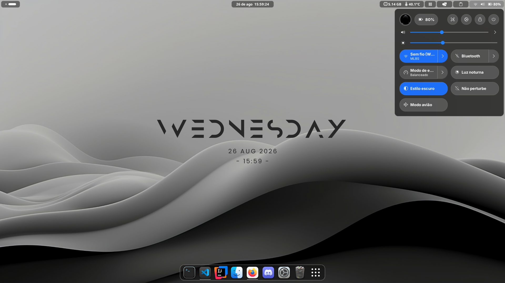 |

## Documentation

- [Theme](theme/THEME.md)
- [GNOME Extensions](gnome/EXTENSIONS.md)
- [Wallpapers](wallpapers/WALLPAPERS.md)

> [!WARNING]
> **Experimental Project**
>
> This repository is experimental and intended for personal use. The included scripts may modify system and user configuration, install packages, alter GNOME settings, and change the desktop environment.
>
> Use these dotfiles at your own risk. **I take no responsibility for data loss, system damage, configuration issues, broken packages, or any other consequences resulting from the use of this repository.**
>
> Make sure you understand what each script does before executing it and keep a backup of any important data and configuration.

## Installation

The default installation creates a backup and applies the tracked GNOME extension settings:

```bash
make install
```

Create a manual backup:

```bash
make backup
```

Install the GNOME extensions:

```bash
make install-extensions
```

Apply the extension settings directly:

```bash
make dconf
```

Install the packages listed in `packages.txt`:

```bash
make packages
```

Install the Flatpak applications listed in `flatpak.txt`:

```bash
make flatpak
```


Run the uninstall routine:

```bash
make uninstall
```

> [!WARNING]
> It is recommended to end the session after any operation.